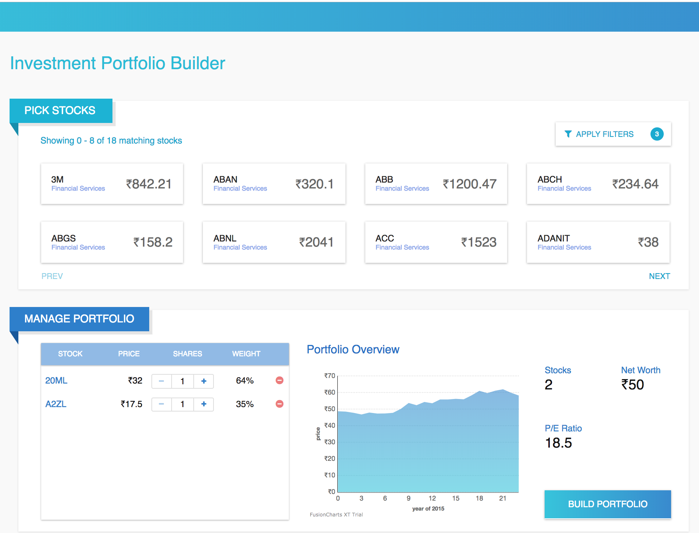

# Portfolio Builder
### Investment portfolio creating tool

Hosted at https://portfoliobuilder.netlify.com



## Dev setup

### To set up the environment dependencies

```
$ npm install
```

### To run the portflio builder app

```
$ npm run start
```
Client app is served on port `3000`

## Deployment steps

### To build the portflio builder app

```
$ npm run build
```
Serve the `build` folder using any static server.